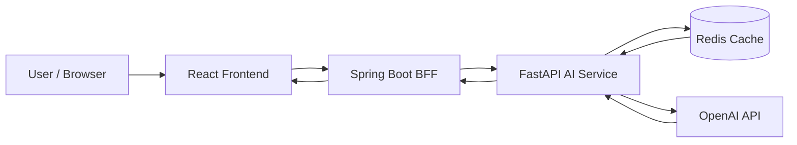
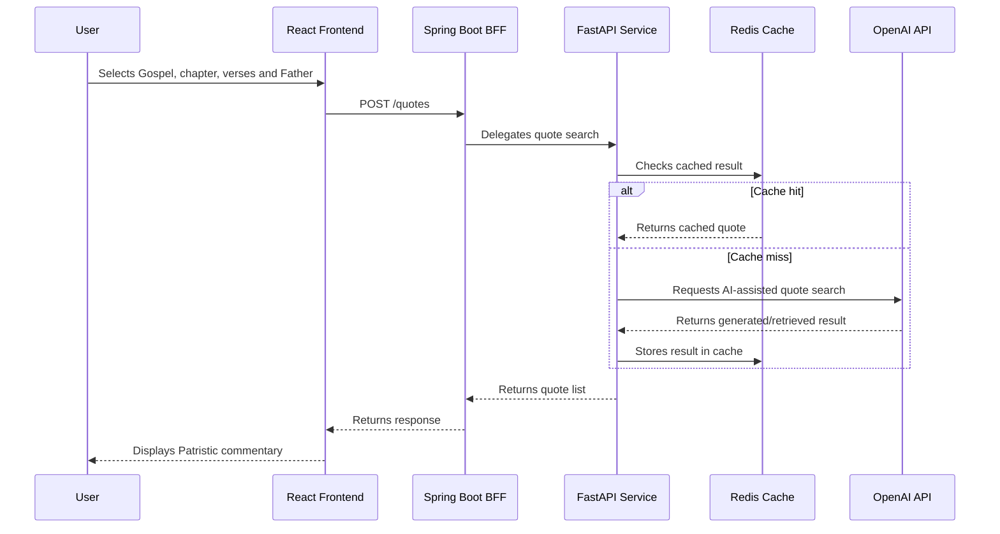
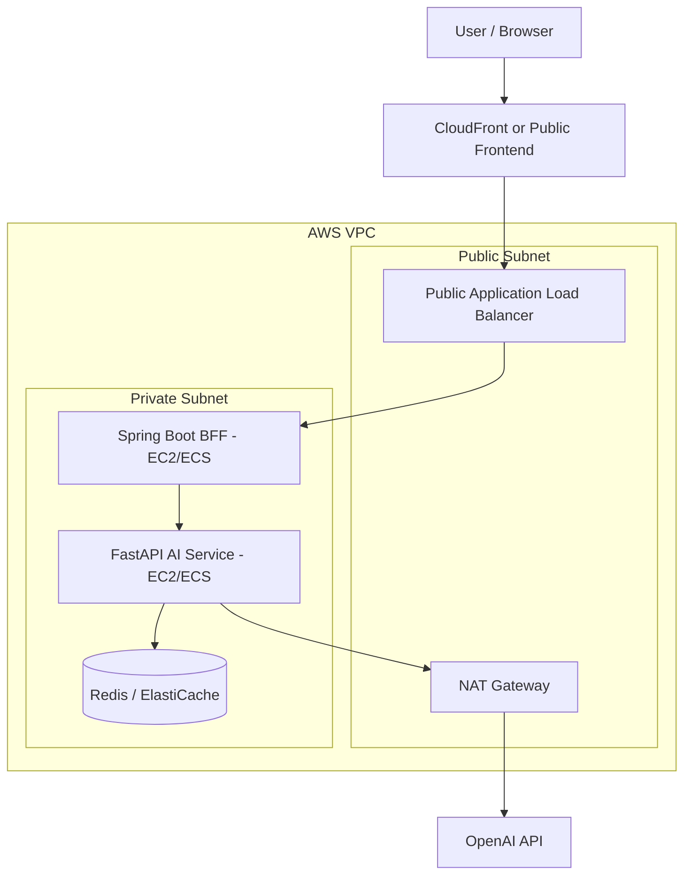

# Patristic Quote SaaS

> A full-stack SaaS-style application for searching Patristic commentary on Gospel passages using a React frontend, a Spring Boot BFF, a FastAPI AI service, OpenAI integration, and Redis caching.


---

## Overview

**Patristic Quote SaaS** is an experimental full-stack application designed to retrieve Christian Patristic commentary based on a selected Gospel passage.

The user selects:

- a Gospel author;
- a chapter;
- an initial and final verse;
- optionally, a specific Church Father.

The frontend generates a structured payload and sends it to the backend:

```json
{
  "passagem": "Mateus 4:12-25",
  "father": "São João Crisóstomo"
}
```

The request flows through a **Spring Boot BFF**, which delegates the search to a **FastAPI service** responsible for AI-assisted retrieval and Patristic quote generation. Redis is used as a cache layer to avoid unnecessary repeated calls.

---

## Demo

A local demonstration video is available in the repository:

[Watch the demo video](./iaas-santos-padres.mp4)

The current frontend demonstration can run with mocked data, allowing the UI and user flow to be reviewed even before consuming the real AI backend.

---

## Project Goals

This project was built as a practical study of:

- modern frontend development with React, TypeScript, Vite and Tailwind CSS;
- BFF architecture using Spring Boot;
- backend-to-backend communication using OpenFeign;
- AI-powered retrieval using FastAPI and OpenAI;
- Redis-based caching;
- Docker-based local infrastructure;
- cloud architecture planning for a future AWS deployment.

---

## Architecture

### High-Level Flow



### Runtime Responsibilities

| Layer | Technology | Responsibility |
|------|------------|----------------|
| Frontend | React + TypeScript + Vite | Provides the UI, validates user input, builds the search payload and displays results |
| BFF | Spring Boot + OpenFeign + Resilience4j | Exposes the frontend-facing API and delegates requests to the FastAPI service |
| AI Service | FastAPI + Python | Handles AI-assisted Patristic quote search and orchestration |
| Cache | Redis | Caches generated or retrieved results to reduce repeated processing |
| External AI | OpenAI API | Provides AI capabilities for quote retrieval/generation |

---

## Repository Structure

```txt
patristic-quote-saas/
├── api/
│   ├── application/
│   ├── cache/
│   ├── const/
│   ├── controller/
│   ├── domain/
│   ├── infra/
│   ├── orchestrator/
│   ├── search/
│   ├── utils/
│   ├── Dockerfile
│   ├── main.py
│   └── requirements.txt
│
├── bff/
│   ├── src/
│   ├── mvnw
│   ├── mvnw.cmd
│   └── pom.xml
│
├── react-client/
│   └── patristic-quotes-front/
│       ├── public/
│       ├── src/
│       ├── package.json
│       ├── vite.config.ts
│       └── tsconfig.json
│
├── docker-compose.yml
├── iaas-santos-padres.mp4
└── README.md
```

---

## Tech Stack

### Frontend

- React
- TypeScript
- Vite
- Tailwind CSS
- shadcn/ui
- React Hook Form
- Zod
- Framer Motion
- Lucide React

### BFF

- Java 21
- Spring Boot
- Spring Web MVC
- Spring Cloud OpenFeign
- Resilience4j Circuit Breaker

### AI Service

- Python
- FastAPI
- OpenAI SDK
- Redis integration

### Infrastructure

- Docker
- Docker Compose
- Redis

---

## Main Features

### Current Features

- Gospel selection.
- Chapter selection.
- Initial and final verse selection.
- Input validation based on Gospel/chapter constraints.
- Optional Church Father selection.
- Manual Church Father input mode.
- Loading state while searching.
- Result rendering with quote, author, source and confidence level.
- Mock mode for frontend demonstration.
- Redis cache available for the FastAPI service.
- BFF layer prepared to isolate the frontend from the AI service.

### Planned Features

- Production-ready OpenAI integration.
- More robust Patristic source validation.
- Better quote source traceability.
- Authentication and user history.
- Saved searches.
- AWS deployment.
- CI/CD pipeline.
- Observability and structured logs.

---

## Request Payload

The frontend sends a payload like:

```json
{
  "passagem": "Mateus 4:12-25",
  "father": "São João Crisóstomo"
}
```

If no Church Father is selected, the payload may omit the `father` field:

```json
{
  "passagem": "Mateus 4:12-25"
}
```

---

## Example Response

```json
[
  {
    "nome": "São João Crisóstomo",
    "texto": "Vês como Ele não fica em um lugar, mas viaja de cidade em cidade?...",
    "fonte": "https://catenabible.com/mt/4/12-25#chrysostom",
    "confianca": "alta"
  }
]
```

---

## Getting Started

### Prerequisites

Make sure you have installed:

- Node.js
- npm
- Java 21
- Maven or the included Maven Wrapper
- Python 3.11+
- Docker
- Docker Compose

---

## Running the Frontend

```bash
cd react-client/patristic-quotes-front
npm install
npm run dev
```

The frontend should be available at:

```txt
http://localhost:5173
```

---

## Running the FastAPI Service and Redis

From the repository root:

```bash
docker compose up --build
```

This starts:

- FastAPI service on port `8000`;
- Redis on port `6379`.

---

## FastAPI Environment Variables

Create an `.env` file inside the `api/` directory:

```env
OPENAI_API_KEY=your_openai_api_key_here
REDIS_HOST=localhost
REDIS_PORT=6379
```

When running with Docker Compose, Redis is available internally as:

```env
REDIS_HOST=redis
REDIS_PORT=6379
```

---

## Running the Spring Boot BFF

```bash
cd bff
./mvnw spring-boot:run
```

On Windows:

```bash
cd bff
mvnw.cmd spring-boot:run
```

Expected local BFF URL:

```txt
http://localhost:8082
```

---

## Local Development Flow



---

## Cloud Architecture Vision

The project is being designed with a future AWS migration in mind.

A possible target architecture:



### Future AWS Components

- S3 + CloudFront for the React frontend.
- Application Load Balancer for public API routing.
- Private subnet for Spring Boot BFF and FastAPI.
- ElastiCache Redis for managed caching.
- NAT Gateway for private services calling external APIs.
- ECS or EC2 for containerized application hosting.
- AWS Secrets Manager or Parameter Store for secrets.
- CloudWatch for logs and metrics.

---

## Why This Architecture?

The project separates responsibilities clearly:

- the **React frontend** focuses on user experience and payload construction;
- the **Spring Boot BFF** protects the frontend from backend complexity;
- the **FastAPI service** isolates AI-related logic;
- **Redis** reduces repeated expensive AI calls;
- the architecture is ready to evolve from local development to cloud deployment.

This structure makes it easier to scale, test, replace or deploy each layer independently.

---

## About Mermaid Diagrams

This README uses **Mermaid** to document architecture and runtime flows directly inside Markdown.

Mermaid is especially useful for software architecture because the diagram is written as text. This makes the architecture:

- versionable in Git;
- easy to review in pull requests;
- easy to update when the system changes;
- readable even without opening an external drawing tool;
- renderable directly on GitHub.

Instead of maintaining a separate image that may become outdated, the architecture lives beside the code and evolves with it.

For example, this project uses Mermaid to express both a simple system flow and a more detailed AWS-oriented deployment vision.

That makes it a strong choice for early-stage architecture work, especially when the goal is clarity, maintainability and technical communication rather than visual decoration.

---

## Development Status

This project is under active development.

Current focus:

- improving frontend UX;
- validating the request/response contract;
- integrating the real backend flow;
- improving AI quote reliability;
- preparing the project for cloud deployment.

---

## Author

Developed by [Felipe Matheus](https://github.com/felipematheus1337).

---

## Disclaimer

This project is educational and experimental. The goal is to explore full-stack architecture, AI integration, caching and cloud deployment patterns while building a useful tool for searching Patristic commentary.

Patristic quote retrieval should be reviewed carefully against primary sources before being used for academic, theological or devotional publication.
